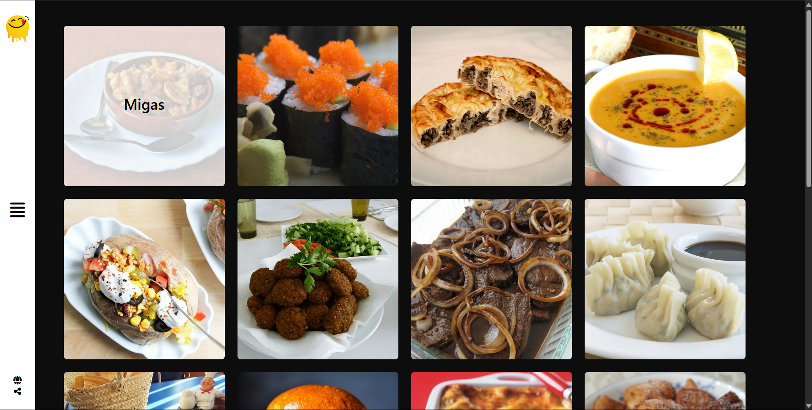
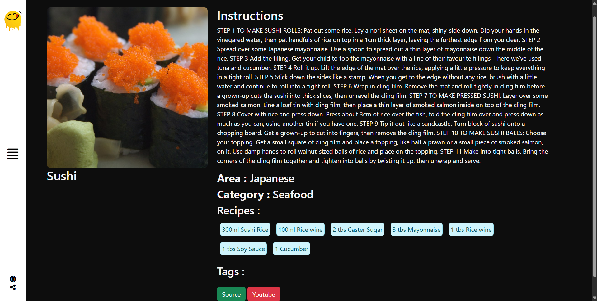

# 🍽️ Yummy

Discover and explore delicious meals and recipes from around the world with **Yummy**!  
A modern, responsive web app for food lovers to search, browse, and learn about a wide variety of dishes.

---

## 🚀 Features

- **Search Meals:** Instantly find meals by name or by the first letter.
- **Browse by Category:** Explore meals grouped by categories like Beef, Chicken, Dessert, and more.
- **Browse by Area:** Discover dishes from different countries and regions.
- **Browse by Ingredients:** Find meals based on your favorite ingredients.
- **Detailed Meal View:** See instructions, ingredients, tags, and source links for each meal.
- **Responsive Design:** Works seamlessly on desktop and mobile devices.
- **Interactive Side Navigation:** Smooth, animated side menu for easy navigation.
- **Contact Form:** Built-in form with real-time validation for user feedback.

---

## 🖼️ Screenshots

 <!-- Add your screenshot here if available -->
 <!-- Add your screenshot here if available -->

---

## 🛠️ Technologies Used

- **HTML5 & CSS3** (with Bootstrap)
- **JavaScript** (ES6+)
- **jQuery**
- **[TheMealDB API](https://www.themealdb.com/api.php)**

---

## 📦 Getting Started

1. **Clone the repository:**
   ```bash
   git clone https://github.com/Ahmedtamerr505/Yummy.git
   ```
2. **Navigate to the project folder:**
   ```bash
   cd yummy
   ```
3. **Open `index.html` in your browser.**

> No build steps or server required — everything runs in your browser!

---

## 📂 Project Structure

```
yummy/
│
├── css/
│   ├── all.min.css
│   ├── bootstrap.min.css
│   └── style.css
├── img/
│   └── logo.png
├── js/
│   ├── index.js
│   └── jquery-3.7.1.min.js
├── index.html
└── README.md
```

---

## ✨ Credits

- Meal data provided by [TheMealDB](https://www.themealdb.com/).
- UI icons from [Font Awesome](https://fontawesome.com/).

---

## 📧 Contact

For feedback or questions, please use the **Contact Us** form in the app or open an issue on GitHub.

---

Enjoy exploring new recipes with **Yummy**! 🍲